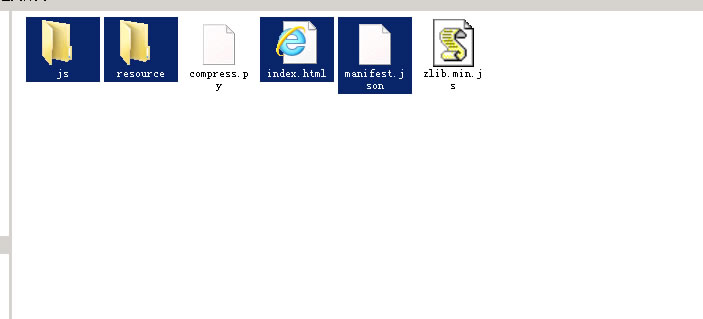

## 简介

* 压缩白鹭引擎发布生成HTML5的js代码，稍事修改其它引擎同理。

* 库和逻辑压缩在一起，可根据需要选择是否拆分成两个。

* 实际效果可先使用压缩工具zip本地代码预览。 压缩掉大概80%

* 加载顺序  index.html -> zlib.min.js -> game.cfg -> enter game

## 文件

* compress.py    
    *  压缩js的工具，读manifest.json，压入game.cfg。
    *  扩展名使用cfg，zip可能被下载软件拦截。

* zlib.min.js      17.4k
    *  文件比jszip.min小十几倍。
    *  可直接操作缓冲区。

* index.html
    *  加载压缩代码的代码。
    *  如果不是白鹭引擎，修改启动处。

## 目录参考
* 发布后可删除js文件夹，以及mainfest.json。

---

## Introduction

* compression egret engine generates HTML5 js code, slightly modify other engines to do the same.

* the library and logic are compressed together and can be split into two if needed.

* the actual effect can be previewed using the compression tool zip native code.

* load order index.html -> zlib.min.js -> game.cfg -> enter game

## Files

* compress.py    
    *  compress js tools, read the manifest.json, compress into the game.cfg
    *  extensions using cfg, could be download software to intercept the zip.

* zlib.min.js      17.4k
    *  the file is ten times smaller than jszip.min.
    *  the buffer can be manipulated directly.

* index.html
    *  load the code for the compressed code.

## Directory reference
* after publishing, you can delete the js folder and mainfest.json.

